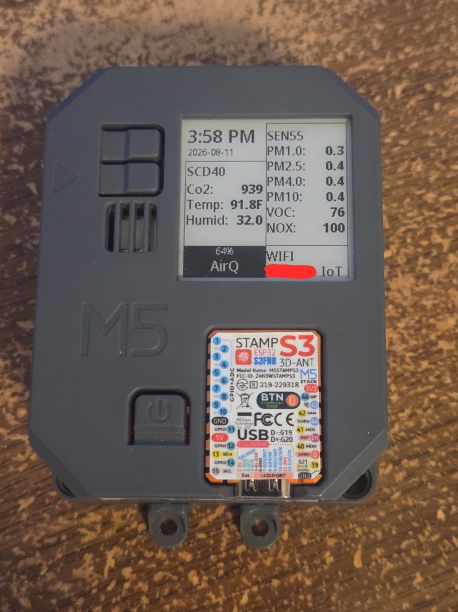

# ESPHome — M5Stack AirQ

Community [ESPHome](https://esphome.io/) configuration for the [M5Stack AirQ](https://docs.m5stack.com/en/app/AirQ): StampS3 (ESP32-S3), Sensirion SEN55, SCD40, and 1.54″ e-ink display.

This example goes beyond a USB-only plug-and-flash config: it latches the battery **HOLD** line, reads pack voltage, shows a SoC gauge on the display, can shut down on low voltage, and switches between **Auto / USB / Battery** power profiles (SEN55 PM bursts + lower duty cycle on battery).

## Display preview



Photo of a unit running this config (e-ink layout with battery % on the bottom bar). Replace [`images/display.jpg`](images/display.jpg) anytime — see [`images/README.md`](images/README.md). Optional wider hardware-only shot: `images/device.jpg`.

> **Status:** Repository is private while the config is polished. It will be made public when ready. A follow-up PR to [devices.esphome.io](https://devices.esphome.io/devices/m5stack-airq/) is planned after that (catalog page uses a separate, validator-friendly `config.yaml` layout).

## Requirements

- M5Stack AirQ hardware
- ESPHome (tested with recent 2026.x / ESP-IDF on ESP32-S3, `flash_size: 8MB`)
- Home Assistant (native API) recommended for time sync and entities

## Quick start

1. Copy `secrets.yaml.example` → `secrets.yaml` and set Wi‑Fi, API encryption key, and OTA password.
2. Edit substitutions in `airq.yaml` (`devicename`, `location`, `fallback_timezone`, `clock_hours`, `display_temperature_scale`, battery thresholds, etc.).
3. Compile and flash (USB serial for first install; OTA afterward):

```bash
esphome run airq.yaml
```

Or use the ESPHome dashboard / your usual builder workflow. Point the builder at this directory so `secrets.yaml` resolves next to `airq.yaml`.

## Notable features

| Feature | Notes |
| --- | --- |
| HOLD latch (`GPIO46`) | Internal `ALWAYS_ON` switch so battery power stays latched early in boot |
| Battery voltage (`GPIO14`) | 1M/1M divider; YAML multiplies by 2 for pack V |
| Battery % + e-ink gauge | Piecewise LiPo curve; shutdown uses **voltage**, not % |
| Power mode select | Auto / USB / Battery — Auto uses pack V + drain-rate hysteresis |
| Battery saver | Wi‑Fi `LIGHT`, no `web_server`, SCD4x `low_power_periodic`, SEN55 PM bursts |
| Display | Warm-up screen, SCD40 / SEN55 layout, clock (HA time with SNTP fallback) |

## Substitutions (high level)

See comments at the top of [`airq.yaml`](airq.yaml). Important ones:

- `fallback_timezone` — IANA zone for SNTP when the HA API is down (default `Etc/UTC`)
- `clock_hours` — `"24"` or `"12"`
- `display_temperature_scale` — `"C"` or `"F"` for the e-ink Temp row only (HA temperature entity stays °C)
- `battery_shutdown_voltage` — `0` disables auto power-off; otherwise under-load pack volts for HOLD release
- `usb_detect_voltage` — Auto mode threshold between USB/full and battery saver

## Secrets

```yaml
wifi_ssid: "..."
wifi_password: "..."
api_encryption_key: "..."   # ESPHome API encryption key
ota_password: "..."
```

Generate an API key with `esphome wizard` / the ESPHome UI encryption key helper as you prefer.

## Relationship to devices.esphome.io

The [official device page](https://devices.esphome.io/devices/m5stack-airq/) hosts a catalog-style example. That site’s contribution rules require a secrets-free, hardware-focused `config.yaml` (no `!secret`, limited top-level components). **This repo** is the full, HA-oriented config with battery management. After this repository is public, the plan is to point the device page’s `project-url` here and update the catalog docs (including battery support).

## License

MIT — see [LICENSE](LICENSE).

Not affiliated with M5Stack or ESPHome; use at your own risk.
